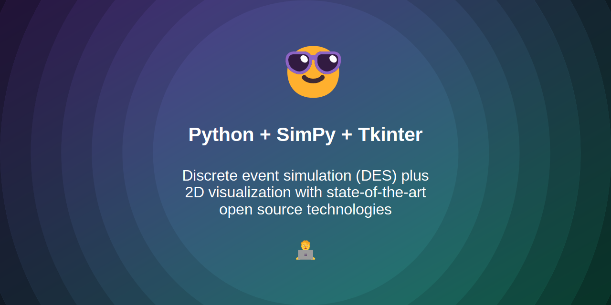
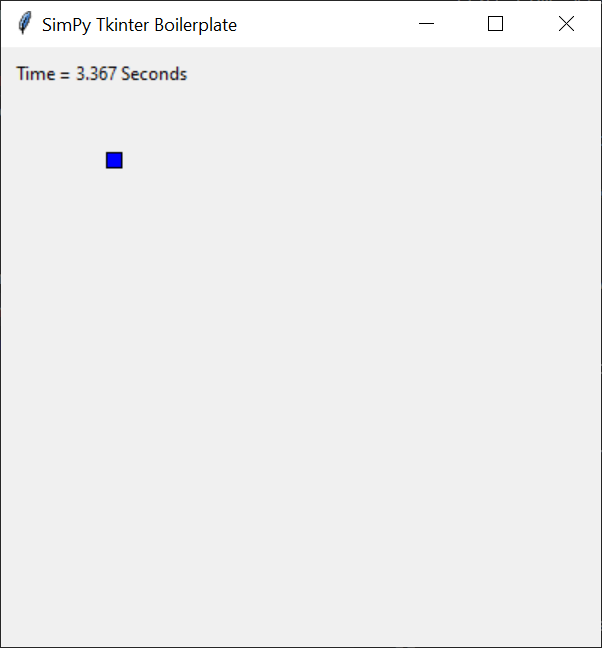

# SimPy and Tkinter Boilerplate



This boilerplate project demonstrates the use of **Tkinter** for real-time visualization of discrete event simulations with **SimPy**.

## Examples

The following code snippet shows the basic structure of the simulation program. The simulation itself is executed in a separate simulation thread, while the GUI uses the main thread.

```python
import threading
import tkinter
import simpy
import simpy.rt

# define the simulation ticks per second
ticks_per_second = 30
# define the total duration of the simulation run
duration = 10 * ticks_per_second

# create Tkinter common objects here
window = tkinter.Tk()

def run():
    env = simpy.rt.RealtimeEnvironment(factor=1/ticks_per_second, strict=False)
    # define SimPy events here
    # create SimPy resources here
    # attach SimPy processes here
    env.run(until=duration)

# run SimPy simulation event processing in simulation thread
thread = threading.Thread(target=run)
thread.start()

# run Tkinter interaction event processing and component rendering in main thread
window.mainloop()
```

## Screenshots

When executing the simulation program, you should see the following real-time visualization.



## Guides

### Prepare the development environment

Download and install the SimPy discrete event simulation library.

```
pip install simpy
```

### Run the simulation program

Execute the simulation program with your standard Python interpreter.

```
python ./sources/main.py
```