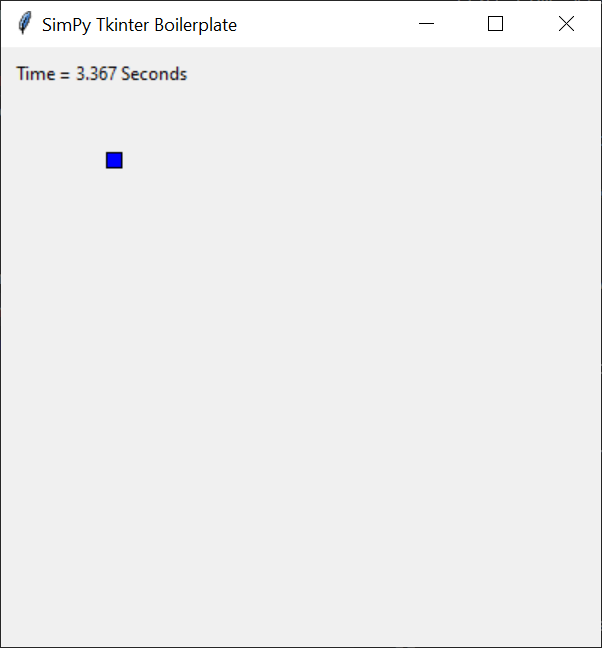

# SimPy and Tkinter Boilerplate

This boilerplate project demonstrates the use of **Tkinter** for real-time visualization of discrete event simulations with **SimPy**.

## Screenshots

When executing the simulation program, you should see the following real-time visualization.



## Guides

### Prepare the development environment

Install the **virtualenv** package globally.

```
pip install virtualenv
```

Create a virtual Python environment.

```
python -m venv env
```

Activate the virtual python environment.

```
./env/Scripts/activate
```

Install dependencies (i.e. SimPy).

```
pip install -r requirements.txt
```

### Run the simulation program

Activate the virtual Python environment created previously.

```
./env/Scripts/activate
```

Execute the simulation program.

```
python ./src/main.py
```